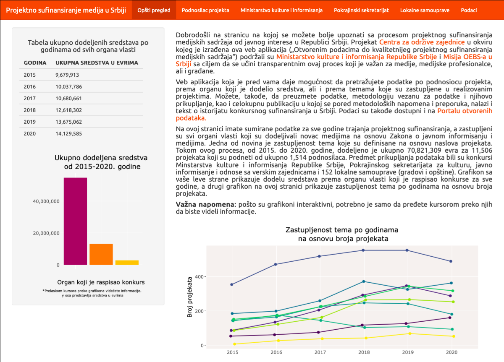
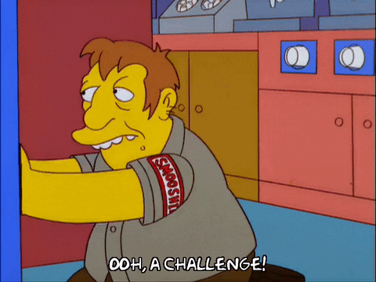
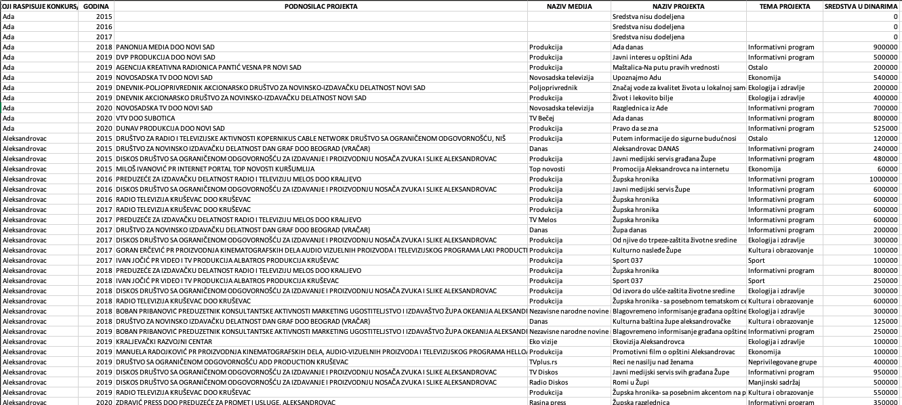
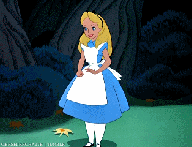

```{r setup, include=FALSE}
knitr::opts_chunk$set(echo = TRUE)

library(tidyverse)

library(plotly)

library(scales)

options(scipen = 999)

tabela<- readxl::read_excel("Projektno sufinansiranje medijavezba.xlsx")

tabela1 <- tabela %>%
  
  select(-c(`MATIČNI BROJ GRADA/OPŠTINE`, `MATIČNI BROJ PODNOSIOCA`, `SREDSTVA U EVRIMA`))

organ <- "Ada"

grafikon <- tabela %>%
  
  group_by(`ORGAN KOJI RASPISUJE KONKURS/OPŠTINA`, `PODNOSILAC PROJEKTA`) %>%
  
  filter(`SREDSTVA U DINARIMA` != 0) %>%
  
  filter(`ORGAN KOJI RASPISUJE KONKURS/OPŠTINA` == organ )%>%
  
   summarize(`SREDSTVA U EVRIMA` = sum(`SREDSTVA U EVRIMA`), n = n()) %>%
  
  arrange(desc(`SREDSTVA U EVRIMA`)) %>%
  
  top_n(5, `SREDSTVA U EVRIMA`) %>%

  mutate(Info = paste(`PODNOSILAC PROJEKTA`, '<br>',
                      
                      "Ukupno:", format (`SREDSTVA U EVRIMA`, big.mark = ',', digits = 0, nsmall = 0, scientific = FALSE), 'eur<br>',
                      
                      "Broj projekata:", n, '<br>'))
  
```


## Projekat Otvorenim podacima do kvalitetnijeg projektnog sufinansiranja medijskih sadržaja

<section>
<a href="https://centarzaodrzivezajednice.shinyapps.io/Projektno_sufinansiranje_medija_u_Srbiji/">
 </a>
</section>


## Interesantni segmenti web aplikacije

- [Online verzija publikacije](https://projektnosufinansiranjehtmlpublikacija.netlify.app/)

- [Rešenja koja su prikupljena od lokalnih samouprava](https://docs.google.com/spreadsheets/d/1ajgnqWStLHUQ8XUA1LU0n5_1KdqcAIef1A4e4391ORI/edit#gid=0)

- [Kod za izradu aplikacije](https://github.com/Centarzaodrzivezajednice/Projektno-sufinansiranje-medija)

- [Podaci u otvorenom i mašinski čitljivom formatu](https://data.gov.rs/sr/datasets/rezultati-konkursa-za-projektno-sufinansiranja-medijskikh-sadrzhaja/)

## 
<section>

</section>

## Izazovi

<style type="text/css">
  .reveal p {
    text-align: justify;
  }
  </style>

- Velika količina neuniformnih rešenja u pdf formatu.

- Nazivi podnosilaca projekata koji su zavedeni pod različitim imenima u rešenjima.

- Nepostojanje informacija u rešenjima o medijima u kojima će se projekat realizovati.

- Pretraživost APR je  limitirana, kvalitet podataka za mašinsko učitavanje takođe.

- Progutana slova, nepotrebni razmaci, znaci navoda (spas u [Open Refine-u](https://openrefine.org)).

- Manjak vremena da se sve još jednom proveri. :)

## 
<section>

</section>

## Šta smo naučili

<style type="text/css">
  .reveal p {
    text-align: justify;
  }
  </style>

- Postaviti što jednostavniju metodologiju za prikupljanje podataka.

- Ukoliko istraživači naiđu na nešto što je u rešenjima što nije pomenuto u metodologiji obavezno da pitaju šta da rade.

- Izazovi APR-a delom rešeni uz pomoć [alata koji omogućava lakše pretraživanje](https://tixwitchy.shinyapps.io/APRmediadata/).

- Objasniti istraživačima zašto je važno da podaci budu ujednačeni.

## 
<section>

</section>

## Glavni podaci

<style type="text/css">
  .reveal p {
    text-align: justify;
  }
  </style>

- Dataset ima ukupno **`r format(nrow(tabela),big.mark = ",")`** unosa i **`r ncol(tabela)`** kolona;
- Obuhvatio je **`r n_distinct(tabela[,1])`** davalaca sredstava: Pokrajinski sekretarijat, Ministarstvo kulture i informisanja i **`r n_distinct(tabela[,1])-2`** lokalne samouprave i **`r format(n_distinct(tabela[,4])-1,big.mark = ",")`** podnosilaca projekata;
- Na osnovu naziva projekta je opredeljeno **`r n_distinct(tabela[,8])`** tematskih celina, a ukupan iznos sredstava u evrima je **`r format(sum(tabela[,10]),big.mark = ",")`**.

```{r, echo=FALSE}
glimpse(tabela)
```

## Vrste varijabli

<style type="text/css">
  .reveal p {
    text-align: justify;
  }
  </style>

**Merljive** mogu se izraziti numerički (Numeric):

- **Integer**: Godine, broj pasa, mačaka

- **Double (Continuous)**: Visina, težina

**Atributivne** mogu se izraziti u vidu  svojih karakteristika ili atributa:

- **Character**: Crno, žuto, belo

- **Factor (Ordinal)**: Hladno, mlako, toplo, vruće

## Mudrost potvrđena u praksi

> *"Retko kada ćete naići na dataset koji možete odmah da analizirate. Biće vam potrebno između 50 i 80 % vremena da očistite i pripremite podatke za analizu"* 
>
> --- brojni saborci koji se bave analizom podataka :)

## Kolone koje su popunjavali istraživači

<section>

</section>

## Tabela sa podacima za jednu opštinu

```{r,echo=FALSE,message=FALSE}

tabelaorgan<- tabela1 %>%
  filter(`ORGAN KOJI RASPISUJE KONKURS/OPŠTINA` == organ )

DT :: datatable (tabelaorgan,rownames = FALSE, options = list(
  bPaginate = TRUE, scrollX=T, lengthMenu=c(5,8), info= FALSE,initComplete = DT::JS(
    "function(settings, json) {",
    "$(this.api().table().container()).css({'font-size': '20px'});",
    "}")))
```


## Finalna tabela sa svim kolonama 

<section>

</section>

## Izgled tabele sa podacima za jednu opštinu

```{r,echo=FALSE,message=FALSE}

tabelaorganfin <- tabela %>%
  filter(`ORGAN KOJI RASPISUJE KONKURS/OPŠTINA` == organ)

DT :: datatable (tabelaorganfin,rownames = FALSE, options = list(
  bPaginate = TRUE, scrollX=T, lengthMenu=c(5,8), info= FALSE,initComplete = DT::JS(
    "function(settings, json) {",
    "$(this.api().table().container()).css({'font-size': '15px'});",
    "}")))
```

## Primer grafikona koji koristi podatke jedne opštine

```{r,echo=FALSE,message=FALSE}
bci <-  ggplot (data = grafikon, aes (x = reorder(`PODNOSILAC PROJEKTA`, -`SREDSTVA U EVRIMA`), y = `SREDSTVA U EVRIMA`,label = `Info`))+
        
        geom_bar (stat = "identity",fill = "#E95420")+
        
        xlab ("Podnosilac projekta")+
        
        scale_y_continuous(name = "Sredstva od 2015-2020. u evrima", labels = comma)+
        
        ggtitle (paste( "Pet podnosilaca koji su dobili najviše sredstava\n od organa/opštine", grafikon[1,1],"koja je dodelila ukupno",format(sum(tabelaorganfin$`SREDSTVA U EVRIMA`),big.mark = ","),"evra"))+
        
        theme (legend.position = "none",
               
               panel.background = element_rect (fill = "transparent"),
               
               plot.background = element_rect (fill = "transparent", color = NA),
               
               plot.title = element_text ( hjust = 0.5),
               
               
               axis.text.x = element_blank(),
               
               axis.ticks = element_blank(),
               
               plot.margin = unit(c(1.5,1,1.5,1.2), "cm"))
      
      ggplotly( bci, tooltip = "Info") %>%
        
        config(displayModeBar=FALSE)
        
        
```


## Gde sve možete besplatno da objavite vaše kreacije

- [Netlify](https://app.netlify.com/drop)

- [Github pages](https://pages.github.com/)

- Ukoliko vaš dashboard ima shiny elemente možete da je objavite preko njihovog servera [Shinyapps.io](https://shiny.rstudio.com/deploy/)

## Dodatni resursi

- Linkovi za [Instalaciju R-a](http://cran.r-project.org) i [R studio-a](https://www.rstudio.com/products/rstudio/download/)
- [Naučimo R kroz flexdashboards](https://tixwitchy.github.io/Dogs-of-New-York/Testhtmlpres.html#/)
- [Uvod u R](https://tanjakec.github.io/blog/introduction-to-r/)
- [Primer kombinovanja dashboards i shiny ]("https://tixwitchy.shinyapps.io/minority_media/")
- [R-ladies Belgrade meetup page](https://www.meetup.com/rladies-belgrade/)


## Kontakt

- [Email](mailto:etijana@gmail.com)
- [Twitter](https://twitter.com/tikiblagojev)
<section>

</section>


## Hvala na pažnji!

<section>

</section>

